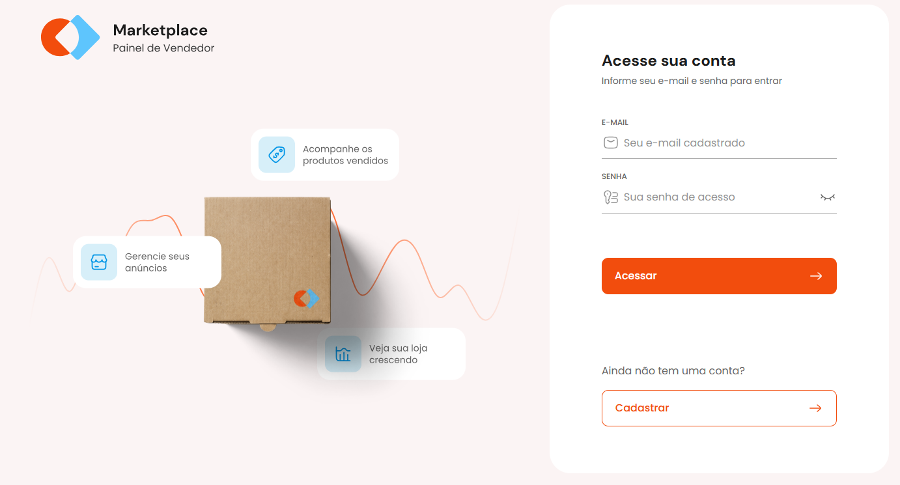
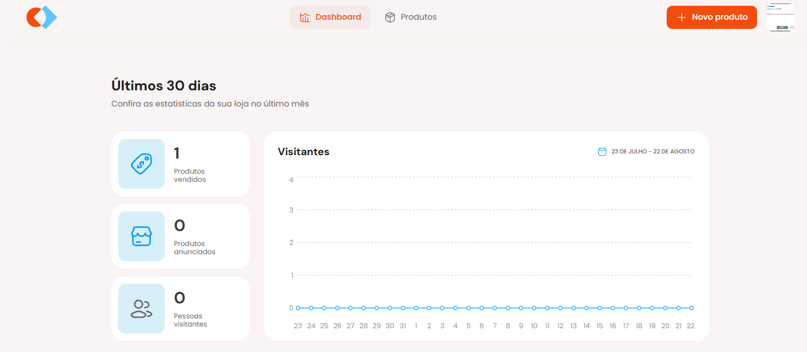

# Marketplace - Painel de Vendedor

## 📋 Sobre o Projeto

Este projeto foi desenvolvido como parte do MBA Full-stack da Rocketseat e Sirius. Trata-se de um sistema de marketplacte para vendedores onde é possível cadastrar usuário, realizar o login, cadastrar produto e editar, visualizar histórico no dashboard etc.

## 🚀 Tecnologias Utilizadas

- HTML
- CSS
- Typescript
- React
- Vite
- Zod
- React Hook Form
- React Router DOM
- Tailwind
- Recharts
- Axios
- Webpack

## 🔧 Instalação

1. Clone este repositório
2. Instale as dependências:

```bash
npm install
```

#### API necessário
```
git clone https://github.com/rocketseat-education/mba-marketplace-server
```

## ⚙️ Executando o Projeto

Para iniciar o servidor de desenvolvimento:

```bash
npm run dev
```

## 📱 Como Usar

Basta realizar um cadastro como usuário e fazer o login.

## 📸 Screenshots

### Login



### Dashboard


## 🎯 Funcionalidades

- Cadastro de usuário;
- Acesso a contra;
- Dashboard;
- Cadastro de produtos;
- Edição de produtos;

## 📄 Licença

Este projeto está sob a licença MIT

## ✨ Autor

Desenvolvido por Daniel Santiago

---

Projeto desenvolvido como parte do MBA Full-stack da Rocketseat e Sirius.